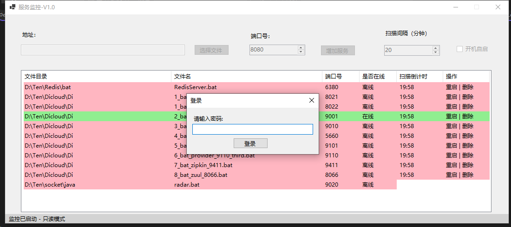
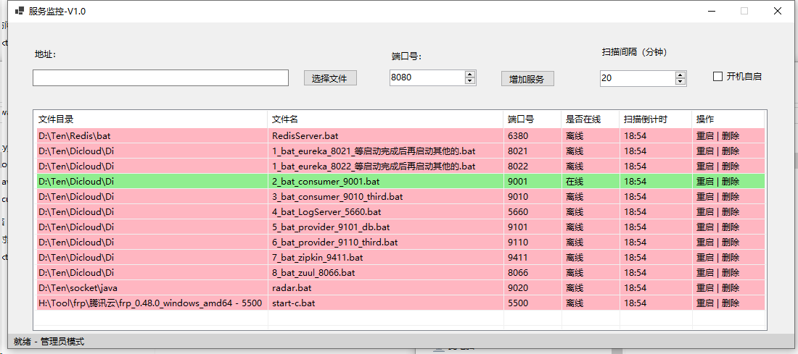

# 端口监控工具

一款功能全面的Windows应用程序，用于监控和自动管理运行在特定端口的服务。

## 概述

端口监控工具是一个强大的实用程序，旨在确保您的服务保持运行状态。它通过检查应用程序是否在指定端口上监听来监控服务，并在服务离线时自动重启它们。这对于维护Web服务器、数据库服务器或任何其他基于端口的服务的可用性特别有用。

## 功能特点

- **服务监控**：自动检查您的应用程序是否在指定端口上运行
- **自动恢复**：重启离线服务以保持系统可用性
- **直观状态显示**：色彩编码界面一目了然显示哪些服务在线或离线
- **可配置间隔**：设置自定义监控间隔以满足您的需求
- **持久化配置**：所有设置和服务定义都存储在SQLite数据库中
- **Windows集成**：可选择系统启动时自动运行
- **安全性**：密码保护的管理员模式用于配置更改
- **资源高效**：优化以使用最少的系统资源

## 开始使用

### 系统要求

- Windows操作系统
- .NET Framework 4.5或更高版本
- 管理员权限（用于首次设置和某些操作）

### 安装

1. 下载最新版本
2. 将文件解压到您喜欢的位置
3. 运行`port_monitor.exe`
4. 首次运行时，输入管理员密码进行配置

### 首次设置

1. 默认管理员密码是`123321`
2. 通过选择可执行文件并指定其端口来添加要监控的服务
3. 设置您喜欢的监控间隔（默认为2分钟）
4. 可选择启用Windows自启动

## 使用指南

### 添加要监控的服务

1. 点击"浏览"按钮或手动输入可执行文件/批处理文件的路径
2. 指定应用程序使用的端口号
3. 点击"添加"开始监控服务

输入文件路径时，应用程序会自动分离目录和文件名以显示在相应列中。

### 管理服务

主显示区域显示所有受监控的服务，包括以下信息：

- **文件目录**：包含服务可执行文件的文件夹
- **文件名**：可执行文件的名称
- **端口号**：服务应该监听的端口
- **是否在线**：服务当前是否在线
- **扫描倒计时**：距离下次扫描的时间
- **操作**：重启或删除服务的按钮

### 服务恢复

- 当服务离线时，端口监控工具将自动尝试重启它
- 应用程序最多尝试重启失败的服务3次
- 如果服务在3次尝试后仍无法启动，它将被标记为失败并需要手动干预
- 重启应用程序时，重启尝试次数将被重置

### 配置选项

- **扫描间隔**：设置端口监控工具检查服务状态的频率（以分钟为单位）
- **自启动**：配置Windows启动时自动运行端口监控工具

更改扫描间隔将重置监控计时器，以更新的间隔开始新的倒计时。

## 管理员模式

大多数配置更改需要管理员访问权限：

- 添加新服务
- 删除现有服务
- 更改扫描间隔
- 修改自启动设置

要进入管理员模式，请在启动时提供密码。默认密码是`123321`。

不在管理员模式下时，应用程序以只读模式运行，您可以查看服务状态但不能进行配置更改。

## 技术信息

- **数据库**：使用SQLite（应用程序目录中的`monitoring_db.sqlite`）
- **异步监控**：所有监控任务异步运行，保持UI响应
- **端口检查**：通过尝试连接到指定端口来验证服务状态
- **进程管理**：精心管理服务进程以防止冲突
- **自启动同步**：自启动复选框与实际Windows注册表设置同步
- **内存优化**：包括定期内存清理以确保长期稳定性

### 数据库结构

应用程序使用SQLite数据库存储：

- 服务信息（路径、文件名、端口、状态）
- 配置设置（扫描间隔、自启动首选项）
- 重启尝试跟踪

如果数据库文件不存在，它将在首次运行时自动创建。

## 故障排除

### 服务无法重启

如果服务无法自动重启：

1. 检查是否有其他进程正在使用所需的端口
2. 验证可执行文件路径是否正确且文件存在
3. 确保应用程序有足够的权限运行服务
4. 尝试通过界面手动重启服务
5. 请记住，在3次失败尝试后，服务将需要手动干预

### 端口监控工具无法启动

如果应用程序无法启动：

1. 验证数据库文件是否损坏（如有必要，删除它以创建新的）
2. 以管理员身份运行应用程序
3. 查看Windows事件查看器以获取更详细的错误消息

## 实现细节

该应用程序实现了几个高级功能：

- **智能进程管理**：对于批处理文件，应用程序分析命令行参数和窗口标题以正确识别和管理CMD窗口
- **端口使用分析**：在重启服务之前，应用程序检查端口是否已被其他进程使用
- **内存优化**：定期垃圾收集和工作集优化，以在长时间运行期间保持性能
- **取消支持**：所有异步操作都正确支持取消，以确保应用程序干净关闭
- **UI线程安全**：所有UI更新都正确地封送到UI线程，以防止跨线程异常

## 安全说明

- 所有服务管理操作都受管理员模式保护
- 在只读模式下运行时，用户仍然可以手动重启服务，但不能修改配置
